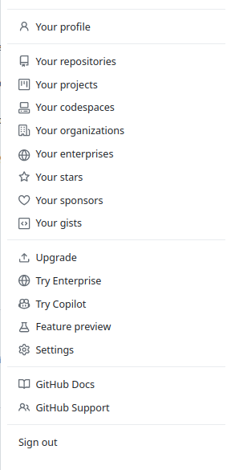

::::::::::::::::::::::::::::::::::::::: objectives

- Configure `git` the first time it is used on a computer.
- Understand the meaning of the `--global` configuration flag.

::::::::::::::::::::::::::::::::::::::::::::::::::

:::::::::::::::::::::::::::::::::::::::: questions

- How do I get set up to use Git?

::::::::::::::::::::::::::::::::::::::::::::::::::

When we use Git on a new computer for the first time,
we need to configure a few things. Below are a few examples
of configurations we will set as we get started with Git:

- our name and email address,
- what our preferred text editor is,
- and that we want to use these settings globally (i.e. for every project).

On a command line, Git commands are written as `git verb options`,
where `verb` is what we actually want to do and `options` is additional optional information which may be needed for the `verb`. So here is how
Sarah sets up her new laptop:

```bash
$ git config --global user.name "Sarah Robertson"
$ git config --global user.email "s.robertson@researcher.co"
```

Please use your own name and email address instead of Sarah's. This user name and email will be associated with your subsequent Git activity,
which means that any changes pushed to
[GitHub](https://github.com/),
[BitBucket](https://bitbucket.org/),
[GitLab](https://gitlab.com/) or
another Git host server
after this lesson will include this information.

For this lesson, we will be interacting with [GitHub](https://github.com/) and so the email address used should be the same as the one used when setting up your GitHub account. If you are concerned about privacy, please review [GitHub's instructions for keeping your email address private][git-privacy].

:::::::::::::::::::::::::::::::::::::::::  callout

## Keeping your email private

If you elect to use a private email address with GitHub, then use that same email address for the `user.email` value, e.g. `username@users.noreply.github.com` replacing `username` with your GitHub one.


::::::::::::::::::::::::::::::::::::::::::::::::::

:::::::::::::::::::::::::::::::::::::::::  callout

## Line Endings

As with other keys, when you hit <kbd>Enter</kbd> or <kbd>↵</kbd> or on Macs, <kbd>Return</kbd> on your keyboard,
your computer encodes this input as a character.
Different operating systems use different character(s) to represent the end of a line.
(You may also hear these referred to as newlines or line breaks.)
Because Git uses these characters to compare files,
it may cause unexpected issues when editing a file on different machines.
Though it is beyond the scope of this lesson, you can read more about this issue
[in the Pro Git book](https://www.git-scm.com/book/en/v2/Customizing-Git-Git-Configuration#_core_autocrlf).

You can change the way Git recognizes and encodes line endings
using the `core.autocrlf` command to `git config`.
The following settings are recommended:

On macOS and Linux:

```bash
$ git config --global core.autocrlf input
```

And on Windows:

```bash
$ git config --global core.autocrlf true
```

::::::::::::::::::::::::::::::::::::::::::::::::::

Sarah also has to set her favorite text editor, following this table:

| Editor                                | Configuration command | 
| :-----------                          | :------------------------------ |
| Atom                                  | `$ git config --global core.editor "atom --wait"`                      | 
| nano                                  | `$ git config --global core.editor "nano -w"`                      | 
| BBEdit (Mac, with command line tools) | `$ git config --global core.editor "bbedit -w"`                      | 
| Sublime Text (Mac)                    | `$ git config --global core.editor "/Applications/Sublime\ Text.app/Contents/SharedSupport/bin/subl -n -w"`                      | 
| Sublime Text (Win, 32-bit install)    | `$ git config --global core.editor "'c:/program files (x86)/sublime text 3/sublime_text.exe' -w"`                      | 
| Sublime Text (Win, 64-bit install)    | `$ git config --global core.editor "'c:/program files/sublime text 3/sublime_text.exe' -w"`                      | 
| Notepad (Win)                         | `$ git config --global core.editor "c:/Windows/System32/notepad.exe"`                      | 
| Notepad++ (Win, 32-bit install)       | `$ git config --global core.editor "'c:/program files (x86)/Notepad++/notepad++.exe' -multiInst -notabbar -nosession -noPlugin"`                      | 
| Notepad++ (Win, 64-bit install)       | `$ git config --global core.editor "'c:/program files/Notepad++/notepad++.exe' -multiInst -notabbar -nosession -noPlugin"`                      | 
| Kate (Linux)                          | `$ git config --global core.editor "kate"`                      | 
| Gedit (Linux)                         | `$ git config --global core.editor "gedit --wait --new-window"`                      | 
| Scratch (Linux)                       | `$ git config --global core.editor "scratch-text-editor"`                      | 
| Emacs                                 | `$ git config --global core.editor "emacs"`                      | 
| Vim                                   | `$ git config --global core.editor "vim"`                      | 
| VS Code                               | `$ git config --global core.editor "code --wait"`                      | 

It is possible to reconfigure the text editor for Git whenever you want to change it.

:::::::::::::::::::::::::::::::::::::::::  callout

## Exiting Vim

Note that Vim is the default editor for many programs. If you haven't used Vim before and wish to exit a session without saving
your changes, press <kbd>Esc</kbd> then type `:q!` and hit <kbd>Enter</kbd> or <kbd>↵</kbd> or on Macs, <kbd>Return</kbd>.
If you want to save your changes and quit, press <kbd>Esc</kbd> then type `:wq` and hit <kbd>Enter</kbd> or <kbd>↵</kbd> or on Macs, <kbd>Return</kbd>.


::::::::::::::::::::::::::::::::::::::::::::::::::

Git (2.28+) allows configuration of the name of the branch created when you
initialize any new repository.  Sarah decides to use that feature to set it to `main` so
it matches the cloud service she will eventually use.

```bash
$ git config --global init.defaultBranch main
```

:::::::::::::::::::::::::::::::::::::::::  callout

## Default Git branch naming

Source file changes are associated with a "branch."
For new learners in this lesson, it's enough to know that branches exist, and this lesson uses one branch.  
By default, Git will create a branch called `master`
when you create a new repository with `git init` (as explained in the next Episode). This term evokes
the racist practice of human slavery and the
[software development community](https://github.com/github/renaming)  has moved to adopt
more inclusive language.

In 2020, most Git code hosting services transitioned to using `main` as the default
branch. As an example, any new repository that is opened in GitHub and GitLab default
to `main`.  However, Git has not yet made the same change.  As a result, local repositories
must be manually configured to have the same main branch name as most cloud services.

For versions of Git prior to 2.28, the change can be made on an individual repository level.  The
command for this is in the next episode.  Note that if this value is unset in your local Git
configuration, the `init.defaultBranch` value defaults to `master`.

::::::::::::::::::::::::::::::::::::::::::::::::::

The five commands we just ran above only need to be run once: the flag `--global` tells Git
to use the settings for every project, in your user account, on this computer.

Let's review those settings and test our `core.editor` right away:

```bash
$ git config --global --edit
```

Let's close the file without making any additional changes.  Remember, since typos in the config file will cause
issues, it's safer to view the configuration with:

```bash
$ git config --list
```

And if necessary, change your configuration using the
same commands to choose another editor or update your email address.
This can be done as many times as you want.

:::::::::::::::::::::::::::::::::::::::::  callout

## Proxy

In some networks you need to use a
[proxy](https://en.wikipedia.org/wiki/Proxy_server). If this is the case, you
may also need to tell Git about the proxy:

```bash
$ git config --global http.proxy proxy-url
$ git config --global https.proxy proxy-url
```

To disable the proxy, use

```bash
$ git config --global --unset http.proxy
$ git config --global --unset https.proxy
```

::::::::::::::::::::::::::::::::::::::::::::::::::

## SSH Background and Setup

Before Sarah can connect to a remote repository, she needs to set up a way for her computer to authenticate with GitHub so it knows it's her trying to connect to her remote repository.

We are going to set up the method that is commonly used by many different services to authenticate access on the command line. This method is called Secure Shell Protocol (SSH).  SSH is a cryptographic network protocol that allows secure communication between computers using an otherwise insecure network.

The SSH protocol uses what is called a key pair. It requires two key files that work together to help you authenticate with cloud services. To set it up, you upload the public key file to a cloud service like GitHub. 

You can think of the public key as a padlock, and only you have the key (the private key) to open it. You use the public key where you want a secure method of communication, such as your GitHub account.  You give this padlock, or public key, to GitHub and say "lock the communications to my account with this so that only computers that have my private key can unlock communications and send git commands as my GitHub account." If you'd like to learn more about SSH, a supplemental episode in this lesson discusses SSH and key pairs in more depth.

Never share or upload the private key file. Someone who has access to the private key may be able to authenticate as you.

We will setup the computer with SSH keys and add the public key to your GitHub account. This process needs to be done once for each device. 

### Check for existing key pairs

The first thing we are going to do is check if this has already been done on the computer you're on.  Because generally speaking, this setup only needs to happen once and then you can forget about it.

We will run the list command to check what key pairs already exist on your computer. SSH key pair files are usually stored in `~/.ssh`.

```bash
ls -al ~/.ssh
```

Your output is going to look a little different depending on whether or not SSH has ever been set up on the computer you are using.

Sarah has not set up SSH on her computer, so her output is

```output
ls: cannot access '/c/Users/Sarah/.ssh': No such file or directory
```

If SSH has been set up on the computer you're using, the public and private key pairs will be listed. The file names are either `id_ed25519`/`id_ed25519.pub` or `id_rsa`/`id_rsa.pub` depending on how the key pairs were set up.
Since they don't exist on Sarah's computer, she uses this command to create them.

### Create an SSH key pair

To create an SSH key pair Sarah uses this command, where the `-t` option specifies which type of algorithm to use and `-C` attaches a comment to the key. Replace Sarah's email address with yours.

```bash
$ ssh-keygen -t ed25519 -C "srobertson@researcher.co"
```

If you are using a legacy system that doesn't support the Ed25519 algorithm, use:
`$ ssh-keygen -t rsa -b 4096 -C "srobertson@researcher.co"`

```output
Generating public/private ed25519 key pair.
Enter file in which to save the key (/c/Users/Sarah/.ssh/id_ed25519):
```

We want to use the default file, so just press <kbd>Enter</kbd>.

```output
Created directory '/c/Users/Sarah/.ssh'.
Enter passphrase (empty for no passphrase):
```

Now, it is prompting Sarah for a passphrase.  Since she is using her kitchen's laptop that other people sometimes have access to, she wants to create a passphrase.  Be sure to use something memorable or save your passphrase somewhere, as there is no "reset my password" option.

```output
Enter same passphrase again:
```

After entering the same passphrase a second time, we receive the confirmation

```output
Your identification has been saved in /c/Users/Sarah/.ssh/id_ed25519
Your public key has been saved in /c/Users/Sarah/.ssh/id_ed25519.pub
The key fingerprint is:
SHA256:SMSPIStNyA00KPxuYu94KpZgRAYjgt9g4BA4kFy3g1o srobertson@researcher.co
The key's randomart image is:
+--[ED25519 256]--+
|^B== o.          |
|%*=.*.+          |
|+=.E =.+         |
| .=.+.o..        |
|....  . S        |
|.+ o             |
|+ =              |
|.o.o             |
|oo+.             |
+----[SHA256]-----+
```

The "identification" is actually the private key. You should never share it.  The public key is appropriately named.  The "key fingerprint"
is a shorter version of a public key.

Now that we have generated the SSH keys, we will find the SSH files when we check.

```bash
ls -al ~/.ssh
```

```output
drwxr-xr-x 1 Sarah   197121   0 Jul 16 14:48 ./
drwxr-xr-x 1 Sarah   197121   0 Jul 16 14:48 ../
-rw-r--r-- 1 Sarah   197121 419 Jul 16 14:48 id_ed25519
-rw-r--r-- 1 Sarah   197121 106 Jul 16 14:48 id_ed25519.pub
```

### Copy the public key to GitHub

Now we have a SSH key pair, we can set up the public key on GitHub so it knows how to authenticate us.

First, we need to copy the public key.  Be sure to include the `.pub` at the end, otherwise you're looking at the private key.

```bash
cat ~/.ssh/id_ed25519.pub
```

```output
ssh-ed25519 AAAAC3NzaC1lZDI1NTE5AAAAIDmRA3d51X0uu9wXek559gfn6UFNF69yZjChyBIU2qKI srobertson@researcher.co
```

Select the output and copy it.

Now, going to GitHub.com, click on your profile icon in the top right corner to get the drop-down menu, and click "Settings".



On the settings page, click "SSH and GPG keys," under the "Access" heading on the left.  


Click the "New SSH key" button on the right side. Add a title to describe which device the key pair files are on. Sarah uses the title "Sarah's Kitchen Laptop" so she can remember. Paste your SSH key into the field, and click the "Add SSH key" to complete the setup.


Now that we've set that up, let's check our authentication from the command line.

```bash
$ ssh -T git@github.com
```

```output
Hi Sarah! You've successfully authenticated, but GitHub does not provide shell access.
```

Good! This output confirms that the SSH key works as intended. We are now ready to push our work to the remote repository.

:::::::::::::::::::::::::::::::::::::::::  callout

## Keeping your keys secure

You shouldn't really forget about your SSH keys, since they keep your account secure. It's good
practice to audit your secure shell keys every so often. Especially if you are using multiple
computers to access your account.


::::::::::::::::::::::::::::::::::::::::::::::::::


:::::::::::::::::::::::::::::::::::::::::  callout

## Git Help and Manual

Always remember that if you forget the subcommands or options of a `git` command, you can access the
relevant list of options typing `git <command> -h` or access the corresponding Git manual by typing
`git <command> --help`, e.g.:

```bash
$ git config -h
$ git config --help
```

While viewing the manual, remember the `:` is a prompt waiting for commands and you can press <kbd>Q</kbd> to exit the manual.

More generally, you can get the list of available `git` commands and further resources of the Git manual typing:

```bash
$ git help
```

::::::::::::::::::::::::::::::::::::::::::::::::::

[git-privacy]: https://help.github.com/articles/keeping-your-email-address-private/


:::::::::::::::::::::::::::::::::::::::: keypoints

- Use `git config` with the `--global` option to configure a user name, email address, editor, and other preferences once per machine.

::::::::::::::::::::::::::::::::::::::::::::::::::


