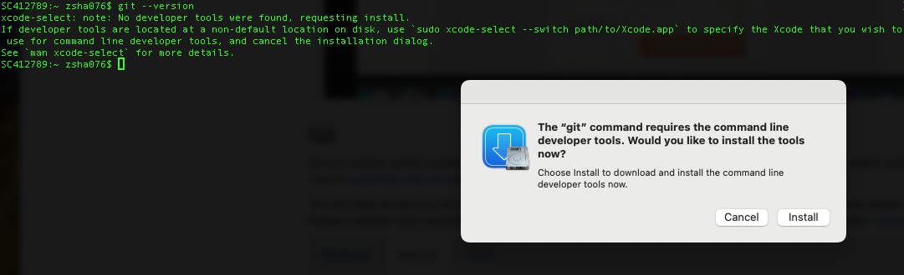

## Installing Git


This workshop relies on an installation of Git and a GitHub account.
Follow these instructions for installing Git for various operating systems.

### Windows
<details>
<summary> Git installation on Windows </summary>


1. Download the [Git for Windows installer](https://gitforwindows.org/).
2. Run the installer and follow the steps below:
   1. Click on "Next" four times (two times if you've previously installed Git). You don't need to change anything in the Information, location, components, and start menu screens.
   2. From the dropdown menu, "Choosing the default editor used by Git", select "Use the Nano editor by default" (NOTE: you will need to scroll up to find it) and click on "Next".
   3. On the page that says "Adjusting the name of the initial branch in new repositories", ensure that "Let Git decide" is selected. This will ensure the highest level of compatibility for our lessons.
   4. Ensure that "Git from the command line and also from 3rd-party software" is selected and click on "Next". (If you don't do this Git Bash will not work properly, requiring you to remove the Git Bash installation, re-run the installer and to select the "Git from the command line and also from 3rd-party software" option).
   5. Select "Use bundled OpenSSH".
   6. Ensure that "Use the native Windows Secure Channel Library" is selected and click on "Next".
   7. Ensure that "Checkout Windows-style, commit Unix-style line endings" is selected and click on "Next".
   8. Ensure that "Use Windows' default console window" is selected and click on "Next".
   9. Ensure that "Default (fast-forward or merge) is selected and click "Next".
   10. Ensure that "Git Credential Manager" is selected and click on "Next".
   11. Ensure that "Enable file system caching" is selected and click on "Next".
   12. Click on "Install" (Do Not check any boxes on this screen).
   13. Click on "Finish" or "Next".
3. If your "HOME" environment variable is not set (or you don't know what this is):
   1. Open command prompt (Open Start Menu then type cmd and press Enter).
   2. Type the following line into the command prompt window exactly as shown:

```bash
$ setx HOME "%USERPROFILE%"
```

   3. Press Enter, you should see:
   ```SUCCESS: Specified value was saved```
   4. Quit command prompt by typing `exit` then pressing Enter


#### Video Tutorial

[](https://www.youtube.com/embed/339AEqk9c-8)


</details>

### MacOS

<details>
<summary> Git installation on MacOS </summary>

- Your version of MacOS may have come with Git pre-installed, you can check with the command:

```bash
git version
```

- if Git is installed you should expect to see an output like:
```
git version 2.45.1
```

- if Git is not installed you will be prompted to install it:



- click "Install" and wait a few minutes and you should have Git installed.

- You can verify this by running `git version` again.

</details>

### Linux

<details>
<summary> Git installation on Linux </summary>
- Your Linux Distribution may have come with Git pre-installed, you can check with the command: 

```bash
git version
```

- if Git is installed you should expect to see an output like:
```
git version 2.45.1
```

- If Git is not already available on your machine you can install it via your distro's package manager. 

For example on Debian/Ubuntu run: 
```bash
sudo apt-get install git
``` 
or for Fedora run: 
```bash 
sudo dnf install git
```
or for Manjaro/Arch run: 
```bash 
sudo pacman -S git
```


</details>


## Preparing Your Working Directory


We'll do our work in the `Documents` folder so make sure you change your working directory to it with:


```bash
$ cd
$ cd Documents
```


## Creating a GitHub account
You will also need an account at [github.com](https://github.com/)  Basic GitHub accounts are free. This workshop requires you to create a GitHub account if you don't have one already.


To Create a GitHub account go to [github.com](https://github.com/) fill the email address you wish to use and select *Sign up for GitHub* then follow the prompts on screen.


We encourage you to use a [strong password](https://docs.github.com/en/authentication/keeping-your-account-and-data-secure/creating-a-strong-password) and please consider what personal information you'd like to reveal on your GitHub account. For example, you may want to review these [instructions for keeping your email address private](https://help.github.com/articles/keeping-your-email-address-private/) provided at GitHub.


